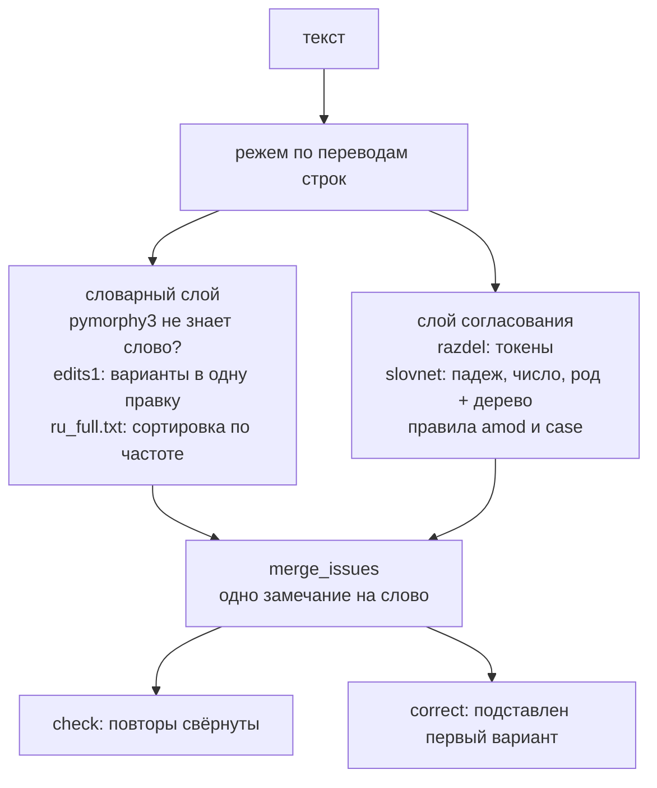

# ruspell

**Проверка орфографии и согласования русского текста.** Отдаёте текст, получаете
замечания. Обязательных зависимостей две, слой синтаксического согласования
опционален и считает на numpy.


```python
from ruspell import SpellChecker

checker = SpellChecker(vocabulary={"техрегламент", "оквэд"})

for issue in checker.check("Указанная работы выполнены согласно приказа."):
    print(issue.word, issue.category, issue.suggestions, issue.message)
# Указанная AGREEMENT ('Указанные',) Не согласовано с «работы» по признакам: Number
# приказа   AGREEMENT ('приказу',)   Предлог «согласно» требует дательный падеж, а не родительный
```

## Зачем

Обычная проверка орфографии сравнивает слово со словарём. Ошибку в слове,
которое в языке есть, она не заметит никогда:

| Текст | Что видит словарь | Что на самом деле |
|---|---|---|
| «согласно **приказа**» | «приказа» есть в языке | предлог требует дательного падежа |
| «**Указанная** работы выполнены» | «указанная» есть в языке | определение не согласовано с вершиной |
| «**даный** документ» | здесь словарь как раз сработает | обычная опечатка |

В деловом тексте ошибок первого типа больше, чем опечаток. Текст пишут и правят
кусками, и рассогласование остаётся там, где правку не довели до конца. Отсюда
два слоя (цифры по каждому в разделе [«Замер»](#замер)):

1. **словарный** ловит слова, которых нет в языке (`pymorphy3` + правки Норвига);
2. **согласование** ищет ошибки в существующих словах по дугам синтаксического
   дерева (`slovnet` разбирает на numpy, torch и JVM не нужны).

## Как это работает



Каждая строка проходит оба слоя независимо. «уведомлеие» pymorphy3 не знает,
в одной правке от него есть «уведомление»: это `SPELL`. В «согласно приказа»
все слова словарные, но slovnet связывает предлог с «приказа» дугой `case`,
видит родительный падеж, а «согласно» требует дательного. pymorphy3 склоняет
слово в «приказу»: это `AGREEMENT`. Если склонить не вышло, замечания нет.
Когда слои отметили одно слово, остаётся словарное замечание.

## Замер

Качество меряем по F₀.₅: точность в ней весит вдвое больше полноты. Замечания
читает человек, и после одного ложного флага он перестаёт верить остальным. Так
считают и в исправлении ошибок (CoNLL-2014, BEA-2019), а F1 стоит в скобках,
чтобы сравнивать с опубликованными числами. Сверху действует отсекающий порог:
метод выбывает при любом F₀.₅, если даёт больше 2 ложных флагов на 1000 токенов
чистого текста или если без ложных проходит меньше 70 % писем.

Письма взяты из внутреннего корпуса: 104 деловых письма, 2136 размеченных
предложений. Для сравнения прогнаны публичные датасеты RUSpellRU (2008
предложений), MultidomainGold (4111), StrategicDocuments (250), MedSpellchecker
(1054) и GitHubTypoCorpusRu (868). ⁿ означает прогон по выборке в 500
предложений: гонять Яндекс.Спеллер и LLM по публичным датасетам целиком дорого,
а по письмам все методы прогнаны полностью. Оговорка: строки со словарём
мерились на собранном доменном словаре, а в библиотеке его нет. Лексику приносит
пользователь, строка «+ доменный словарь» показывает, сколько она стоит.

| Метод | письма | RUSpellRU | MultidomainGold | StrategicDocuments | MedSpellchecker | GitHubTypoCorpusRu |
|---|---|---|---|---|---|---|
| словарный слой (pymorphy3) | 0.052 (0.051) | 0.288 (0.257) | 0.266 (0.218) | 0.245 (0.176) | 0.218 (0.119) | 0.413 (0.304) |
| + доменный словарь | 0.037 (0.018) | 0.288 (0.257) | 0.266 (0.218) | 0.245 (0.176) | 0.218 (0.119) | 0.413 (0.304) |
| только слой согласования | 0.118 (0.099) | 0.000 (0.000) | 0.003 (0.002) | 0.000 (0.000) | 0.118 (0.081) | 0.035 (0.018) |
| **ruspell: оба слоя + словарь** | **0.160 (0.145)** | **0.391 (0.371)** | **0.276 (0.249)** | **0.232 (0.191)** | **0.238 (0.183)** | **0.435 (0.346)** |
| Яндекс.Спеллер, референс | 0.182 (0.167) | 0.755 (0.681) ⁿ | 0.570 (0.428) ⁿ | 0.461 (0.310) ⁿ | 0.327 (0.180) ⁿ | 0.398 (0.346) ⁿ |
| LLM qwen3.8, референс | 0.479 (0.592) | 0.245 (0.311) ⁿ | 0.466 (0.488) ⁿ | 0.536 (0.522) ⁿ | 0.394 (0.420) ⁿ | 0.513 (0.507) ⁿ |

| Метод | Ложных/1000 | Писем без ложных флагов | Порог |
|---|---|---|---|
| словарный слой (pymorphy3) | 2.39 | 63 % | не пройден |
| + доменный словарь | 0.16 | 95 % | пройден |
| только слой согласования | 0.94 | 75 % | пройден |
| расширенный набор правил согласования | 2.45 | 52 % | не пройден |
| **ruspell: оба слоя + словарь** | **1.10** | **71 %** | **пройден** |

F₀.₅ на письмах вырос с 0.052 до 0.160 только у связки целиком. Ложные
срабатывания сбивает доменная лексика (2.39 → 0.16), хотя F₀.₅ у словаря без
согласования проседает до 0.037. Слой согласования возвращает ложные до 1.10,
зато поднимает F₀.₅, порог выдержан. Расширенный набор правил даёт 2.45 и порог
проваливает. Отсюда API: словарь задаёт пользователь, правил согласования два.

## Что находит

* **`SPELL`** ловит слово, которого нет в языке, если в одной правке от него
  есть словарное: «предложния» → «предложения», «уведомлеие» → «уведомление».
* **`AGREEMENT`**, правило `amod`: определение не согласовано с вершиной по
  падежу, числу или роду. «Указанная работы» → «Указанные работы».
* **`AGREEMENT`**, правило `case`: однопадежный предлог требует своего падежа.
  «согласно приказа» → «согласно приказу», «вопреки решения» → «вопреки решению».

## Что не находит

* **Пунктуацию.** Запятые не проверяются вообще.
* **Многопадежные предлоги** («в», «на», «с», «по», «за»). Падеж там зависит от
  смысла, и правило на них срабатывает ложно.
* **Согласование сказуемого с подлежащим**: на этой дуге разбор слишком часто врёт.
* **Смысл, стиль, канцелярит, тавтологию.** Это ищите другими инструментами.
* **Ошибки в словах короче 4 букв и в аббревиатурах** (`ПСД`, `ГОСТ`): вариантов
  замены у них больше, чем пользы.
* **Ошибки в две правки и больше.** «прдлжния» не исправится.

Слово рядом с инициалами («Ветровин А.Б.», «А.Б. Ветровину») не подчёркивается
никогда. Фамилии в словарь класть нельзя: это персональные данные.

## Установка

```bash
uv add ruspell                    # только словарный слой
uv add "ruspell[agreement]"       # + слой согласования

pip install ruspell
pip install "ruspell[agreement]"

# из git, пока пакета нет на PyPI
uv add "ruspell[agreement] @ git+https://github.com/EZHOWWW/ruspell"
pip install "ruspell[agreement] @ git+https://github.com/EZHOWWW/ruspell"
```

Python 3.10+. Обязательно ставятся `pymorphy3` и `pymorphy3-dicts-ru`, больше ничего.
Экстра `agreement` добавляет `slovnet`, `navec`, `razdel` и `numpy`. Ставит её
только `[agreement]` в имени пакета, флаги групп вроде `--all-groups` не помогут.

## Веса

Слой согласования работает на весах моделей, а варианты ранжирует частотный
словарь. В пакет они не входят, их скачивают один раз.

```bash
ruspell-weights download              # в $RUSPELL_WEIGHTS_DIR или ~/.cache/ruspell
ruspell-weights download ./weights    # в конкретный каталог
ruspell-weights download-agreement    # без частотного словаря — 30 МБ вместо 58
python -m ruspell download            # то же самое, если скрипта нет в PATH
```

| Файл | Размер | Зачем | Лицензия |
|---|---|---|---|
| `navec_news_v1_1B_250K_300d_100q.tar` | 25 МБ | эмбеддинги для разбора | MIT, [natasha/navec](https://github.com/natasha/navec) |
| `slovnet_morph_news_v1.tar` | 2 МБ | морфология | MIT, [natasha/slovnet](https://github.com/natasha/slovnet) |
| `slovnet_syntax_news_v1.tar` | 3 МБ | синтаксис | MIT, [natasha/slovnet](https://github.com/natasha/slovnet) |
| `ru_full.txt` | 28 МБ | частоты слов для ранжирования вариантов | MIT, [hermitdave/FrequencyWords](https://github.com/hermitdave/FrequencyWords) |


Каталог задаётся явно или переменной окружения:

```python
SpellChecker(weights_dir=Path("/opt/ruspell-weights"))
```

```bash
export RUSPELL_WEIGHTS_DIR=/opt/ruspell-weights
```

## Быстрый старт

```python
from ruspell import SpellChecker

checker = SpellChecker(vocabulary={"техрегламент", "энергоаудит"})
print(checker.layers)   # ('dictionary', 'agreement') — или только словарь, если весов нет

for issue in checker.check("Направляем предложния по существу вопроса."):
    print(issue.word, issue.start, issue.end, issue.category, issue.suggestions, issue.message)
# предложния 11 21 SPELL ('предложения',)

checker.correct("Уведомлеие и ещё раз уведомлеие.")
# 'Уведомление и ещё раз уведомление.'
```

Готовый пример с доменным словарём лежит в [`examples/quickstart.py`](examples/quickstart.py):

```bash
uv run python examples/quickstart.py
```

## API

### `SpellChecker(vocabulary=(), *, weights_dir=None)`

Собирает слои один раз: словарь pymorphy3 и веса slovnet грузятся секунды,
проверка идёт миллисекунды. **Держите один экземпляр на процесс.** Он неизменяем
и между вызовами ничего не помнит, так что звать его можно из разных потоков.

| Параметр | Тип | Что делает |
|---|---|---|
| `vocabulary` | `Iterable[str]` | Доменная лексика: слова или фразы. Эти слова не считаются ошибкой. Передадите одну строку вместо коллекции, получите `TypeError`. |
| `weights_dir` | `str \| Path \| None` | Где искать веса. По умолчанию `$RUSPELL_WEIGHTS_DIR`, иначе `~/.cache/ruspell`. |

| Метод / свойство | Возвращает | Что делает |
|---|---|---|
| `check(text)` | `list[Issue]` | Находит замечания и сворачивает повторы одной опечатки в одно. |
| `correct(text)` | `str` | Применяет первый вариант каждого замечания и возвращает текст. Повторы **не** свёрнуты: опечатка, встреченная трижды, исправляется трижды. |
| `layers` | `tuple[str, ...]` | Какие слои поднялись: `('dictionary',)` или `('dictionary', 'agreement')`. |
| `weights_dir` | `Path` | Каталог, в котором проверка искала веса. |

Флага, превращающего `check` в `correct`, нет. Нужно и то и другое? Зовите оба.

### `Issue`

Это замороженный `dataclass`, pydantic и другие внешние зависимости ему не нужны.

```python
@dataclass(frozen=True, slots=True)
class Issue:
    word: str                            # слово как оно написано в тексте
    start: int                           # text[issue.start : issue.end] == issue.word
    end: int
    category: IssueCategory              # "SPELL" | "AGREEMENT"
    suggestions: tuple[str, ...] = ()    # варианты замены, лучший первым
    message: str = ""                    # объяснение; у орфографии пустое
```

`issue.as_dict()` отдаёт JSON-совместимый `IssueDict` для HTTP-ответа или лога.
`Issue` не хранит контекст вокруг ошибки: текст у вас на руках, режьте по спану.

### Доменная лексика

| Функция | Что делает |
|---|---|
| `vocabulary_words(phrases)` | Разбирает строки на слова словаря: `["ФТП — Фондтехпроект"]` → `{"фтп", "фондтехпроект"}`. |
| `load_vocabulary(path)` | Читает JSON-файл со списком строк и разбирает его так же. |

### Веса

| Функция | Что делает |
|---|---|
| `default_weights_dir()` | `$RUSPELL_WEIGHTS_DIR` или `~/.cache/ruspell`. |
| `ruspell.weights.missing_weights(dir)` | Какие файлы весов отсутствуют. Пригодится для health-check и `skipif` в тестах. |
| `ruspell.weights.download_weights(dir)` | То же, что консольная команда, но из кода. |
| `ruspell.weights.download_agreement_weights(dir)` | Только веса согласования, без частотного словаря. |

### Чистая логика

Логика лежит в обычных функциях без IO, каждую можно импортировать и проверить:

```python
from ruspell.issues import (
    apply_issues,           # собрать исправленный текст по замечаниям
    collapse_repeats,       # свернуть повторы одной опечатки
    find_dictionary_issues, # найти несловарные слова (предикаты — параметры)
    merge_issues,           # слить слои, сняв пересечения по спану
    near_initials,          # слово рядом с инициалами — это ФИО
    shift,                  # перенести спан в координаты всего текста
)
from ruspell.dictionary import edits1, frequency_ranker, rank_suggestions
from ruspell.vocabulary import drop_vocabulary_words, in_vocabulary
from ruspell.agreement import find_disagreements, find_government_errors, inflect, match_case
from ruspell.check import build_layers, check_text
```

## Своя доменная лексика

Встроенного словаря нет, лексику приносите свою. С пустым словарём проверка
находит то же самое, только шумит на ваших терминах (см. [«Замер»](#замер)).

**Множеством слов:**

```python
SpellChecker(vocabulary={"техрегламент", "теплоузел", "оквэд"})
```

**Фразами: аббревиатура вместе с расшифровкой.** Все слова строки попадут в
словарь. Справочник из вашей базы передаётся так же:

```python
SpellChecker(vocabulary=[
    "ФТП — Фондтехпроект",
    "ПСД — проектно-сметная документация",
])
```

**Из файла** с JSON-списком строк. Образец с вымышленными терминами лежит в
[`examples/vocabulary.json`](examples/vocabulary.json):

```python
from pathlib import Path

from ruspell import SpellChecker, load_vocabulary

SpellChecker(vocabulary=load_vocabulary(Path("vocabulary.json")))
```

**Составные слова** разбирать вручную не нужно. Словом считается
последовательность кириллических букв, текст и словарь режутся по дефису
одинаково: `"машино-мест"` в словаре даст «машино» и «мест», как и в письме.

**Словарь из своего корпуса** собирает
[`examples/build_vocabulary.py`](examples/build_vocabulary.py): берёт слова, что
встретились минимум в трёх *разных* документах и неизвестны pymorphy3.

> ⚠️ Фамилии туда попадут: подписант кочует из документа в документ и проходит
> любой частотный фильтр. **Персональным данным в словаре не место**, словарь
> потом едет в репозиторий и в образ. Скрипт выпишет кандидатов, похожих на ФИО,
> а вычёркивать придётся руками: автоматический фильтр выкидывает термины и всё
> равно пропускает половину фамилий. Проверке фамилии не нужны: рядом с
> инициалами их и так не подчеркнуть.

## Встраивание в свой проект

Про HTTP библиотека не знает ничего: обёртка над `check` занимает три строки.

```python
# app.py — FastAPI здесь только как пример; сама библиотека от него не зависит
from functools import lru_cache

from fastapi import Depends, FastAPI
from pydantic import BaseModel

from ruspell import SpellChecker

app = FastAPI()


@lru_cache(maxsize=1)
def get_checker() -> SpellChecker:
    return SpellChecker(vocabulary=load_my_vocabulary())


class CheckRequest(BaseModel):
    text: str


@app.post("/check")
def check(request: CheckRequest, checker: SpellChecker = Depends(get_checker)) -> dict:
    return {"issues": [issue.as_dict() for issue in checker.check(request.text)]}


@app.get("/health/spelling")
def spelling_health(checker: SpellChecker = Depends(get_checker)) -> dict:
    return {"layers": checker.layers, "weights_dir": str(checker.weights_dir)}
```

* **Соберите `SpellChecker` один раз на старте.** Загрузка около двух секунд,
  проверка миллисекунды, а экземпляр на запрос съел бы сотни мегабайт.
* **Проверка синхронная и считает на CPU.** Большие тексты в async-приложении
  отправляйте через `asyncio.to_thread` / `run_in_threadpool`.
* **Наружу отдавайте `as_dict()`**: контракт API не должен зависеть от `Issue`.

## Поведение без весов

Без слоя согласования библиотека **не падает**, это документированный режим:

| Ситуация | Что происходит |
|---|---|
| экстра `agreement` не установлена | `layers == ('dictionary',)`, в лог `ruspell` уходит warning |
| веса не скачаны или каталог не тот | то же самое |
| архив весов обрезан или несовместим | то же самое |
| разбор упал на конкретной строке | строка проверяется словарём, warning в лог, остальной текст не страдает |
| нет частотного словаря `ru_full.txt` | варианты ранжируются эвристикой по форме слова |
| `ru_full.txt` оборван при закачке | то же самое, warning в лог: обрывок не притворяется словарём |

`check` и `correct` работают всегда. Слои видны в `checker.layers`, причина в логе:

```python
import logging

logging.basicConfig(level=logging.WARNING)
# WARNING:ruspell:Слой согласования не поднялся (Не найдены веса slovnet в
# /home/user/.cache/ruspell: ...) — работает только словарь
```

Без частотного словаря варианты ранжируются заметно хуже: для «предложния»
эвристика выберет «предложная» (та же длина, те же крайние буквы), частоты
выберут верное «предложения». Важен `correct`? Качайте `ru_full.txt`.

## Производительность и память

| | Время | Память процесса |
|---|---|---|
| сборка `SpellChecker` без весов | ~1 с | ~90 МБ (словарь pymorphy3) |
| сборка `SpellChecker` с весами | ~2 с | ~430 МБ (+200 МБ slovnet, +150 МБ частоты) |
| `check` одного предложения | 10–15 мс | - |
| `check` без слоя согласования | <1 мс | - |

Замеры сделаны на обычном ноутбуке. Слой согласования стоит в основном памяти:
если 400 МБ на процесс дорого, не ставьте экстру `agreement` (останется
словарный слой) или не качайте `ru_full.txt` (минус 150 МБ, ранжирование хуже).

## Ограничения

* **Пунктуация не проверяется.** Совсем.
* **Синтаксический разбор ошибается.** Поэтому правил всего два, на них он
  надёжен; расширенный набор порог не прошёл (см. [«Замер»](#замер)).
* **Границей предложения считается перевод строки.** Абзац из пяти предложений
  разбирается как одно, и разбор портится. Важно? Режьте текст сами.
* **Одно замечание на слово.** При пересечении спанов побеждает более ранний,
  словарный слой: двух объяснений на одном слове не будет.
* **`correct` применяет первый вариант вслепую.** Пользователю показывайте
  `check`, а `correct` оставьте черновикам, которые потом смотрят глазами.
* **Только кириллица.** Латиница, цифры и смешанные токены игнорируются.
* **Модели натренированы на новостях** (`*_news_v1`): на разговорном тексте и
  на узкой терминологии разбор хуже.

## Разработка

```bash
git clone https://github.com/EZHOWWW/ruspell
cd ruspell
uv sync                          # с группой dev и слоем согласования; без них: --no-dev
uv run pytest -q                 # проверки согласования скипаются без весов
uv run ruff check .
uv run ruff format --check .
uv run pyright
uv run ruspell-weights download  # чтобы прогнать и их тоже
```

Стиль кода и принципы: [`AGENTS.md`](AGENTS.md). Карта и рецепты: [`CLAUDE.md`](CLAUDE.md).

## Лицензия

MIT, автор Dmitriy Ezhov. Веса и словари скачиваются отдельно и распространяются
их авторами под MIT: [natasha/navec](https://github.com/natasha/navec),
[natasha/slovnet](https://github.com/natasha/slovnet), [hermitdave/FrequencyWords](https://github.com/hermitdave/FrequencyWords).
Морфологию разбирает [pymorphy3](https://github.com/no-plagiarism/pymorphy3) (MIT),
на токены текст режет [natasha/razdel](https://github.com/natasha/razdel) (MIT).
